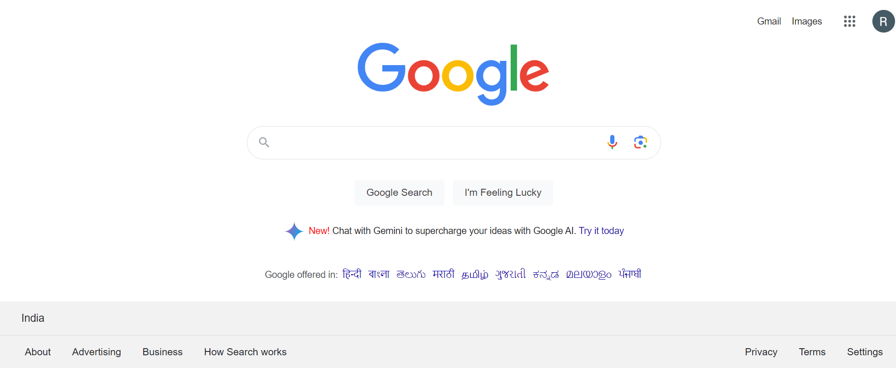

## About
Published on Maven Central that compares 2 images with the same sizes and shows the differences visually by drawing rectangles. Some parts of the image can be excluded from the comparison. Can be used for automation qa tests.

*   Pixels (with the same coordinates in two images) can be visually similar, but have different values of RGB. 2 pixels are considered to be "different" if they differ more than `pixelToleranceLevel`(this configuration described below) from each other.

*   The output of the comparison is a copy of `actual` images. The differences are outlined with red rectangles as shown below.

*   A list of all the mismatches is also returned as output to be asserted as validation

*   Some parts of the image can be excluded from the comparison and drawn in the result image.

## Configuration
All these configurations can be updated based on your needs.

| *Property* | *Description* |
| --- | --- |
| `threshold` | The threshold which means the max distance between non-equal pixels. Could be changed according size and requirements to the image. |
| `rectangleLineWidth` | Width of the line that is drawn the rectangle. |
| `destination` | File of the result destination. |
| `minimalRectangleSize` | The number of the minimal rectangle size. Count as (width x height). By default it's 1. |
| `maximalRectangleCount` | Maximal count of the Rectangles, which would be drawn. It means that would get first x biggest rectangles. Default value is -1, that means that all the rectangles would be drawn. |
| `pixelToleranceLevel` | Level of the pixel tolerance. By default it's 0.1 -> 10% difference. The value can be set from 0.0 to 0.99. |
| `excludedAreas` | ExcludedAreas contains a List of Rectangles to be ignored when comparing images. |
| `drawExcludedRectangles` | Flag which says draw excluded rectangles or not. |
| `fillExcludedRectangles` | Flag which says fill excluded rectangles or not. |
| `percentOpacityExcludedRectangles` | The desired opacity of the excluded rectangle fill. |
| `fillDifferenceRectangles` | Flag which says fill difference rectangles or not. |
| `percentOpacityDifferenceRectangles` | The desired opacity of the difference rectangle fill. |
| `allowingPercentOfDifferentPixels` | The percent of the allowing pixels to be different to stay MATCH for comparison. E.g. percent of the pixels, which would ignore in comparison. Value can be from 0.0 to 100.00 |
| `differenceRectangleColor` | Rectangle color of image difference. By default, it's red. |
| `excludedRectangleColor` | Rectangle color of excluded part. By default, it's green. |
| `imageResizeFlag` | Resize the image equal to expected image before comparison . Default to False |
| `imageResolution` | Sets the image resolution. Default to 70 |


## Usage

#### Maven
```xml
<dependency>
    <groupId>in.testonics.omni</groupId>
    <artifactId>visual</artifactId>
    <version>1.0.0</version>
</dependency>
```
#### Gradle
```groovy
compile 'in.testonics.omni:visual:1.0.0'
```

#### To compare two images programmatically
##### Default way to compare two images looks like:
```java
        //load images to be compared:
        BufferedImage expectedImage = VisualComparisonUtil.readImageFromResources("expected.png");
        BufferedImage actualImage = VisualComparisonUtil.readImageFromResources("actual.png");

        //Create VisualComparison object and compare the images.
        VisualComparisonResult visualComparisonResult = new VisualComparison(expectedImage, actualImage).compareImages();
        
        //Check the result
        assertEquals(VisualComparisonState.MATCH, visualComparisonResult.getImageComparisonState());
```

##### Save result image
To save result image, can be used two ways:
1. add a file to save to constructor. ImageComparison will save the result image in this case.
```java
        //load images to be compared:
        BufferedImage expectedImage = VisualComparisonUtil.readImageFromResources("expected.png");
        BufferedImage actualImage = VisualComparisonUtil.readImageFromResources("actual.png");
        
        // where to save the result (leave null if you want to see the result in the UI)
        File resultDestination = new File( "result.png" );

        //Create VisualComparison object with result destination and compare the images.
        VisualComparisonResult visualComparisonResult = new VisualComparison(expectedImage, actualImage, resultDestination).compareImages();
```
2. execute ImageComparisonUtil.saveImage static method
```java
        //load images to be compared:
        BufferedImage expectedImage = VisualComparisonUtil.readImageFromResources("expected.png");
        BufferedImage actualImage = VisualComparisonUtil.readImageFromResources("actual.png");

        //Create ImageComparison object with result destination and compare the images.
        VisualComparisonResult visualComparisonResult = new VisualComparison(expectedImage, actualImage).compareImages();

        //Image can be saved after comparison, using VisualComparisonUtil.
        VisualComparisonUtil.saveImage(resultDestination, visualComparisonResult.getResult()); 
```

## Demo
Demo shows how `Visual` works.
 
Expected Image


Actual Image


Result


Print the Failures To Assert
```java
        //Image Percentile & Text Mismatch can be printed using VisualComparisonResult.
        System.out.println("Percentile Mismatch : " + visualComparisonResult.getDifferencePercent());
        System.out.println("Textual Mismatch : " + visualComparisonResult.getMismatch()); 
```

Retrieves the text from an Image
```java
        //Image Percentile & Text Mismatch can be printed using VisualComparisonResult.
        System.out.println(Image.getImageText("Image.png")); 
```

## License
This project is Apache License 2.0 - see the [LICENSE](LICENSE) file for details

## Release Notes

Can be found in [RELEASE_NOTES](RELEASE_NOTES.md).

## Code of Conduct
Please, follow [Code of Conduct](CODE_OF_CONDUCT.md) page.

#### Also if you're interesting - see my other repositories
*   [Keep Alive](https://github.com/testoncis/keep-alive) - Keeps the computer awake
